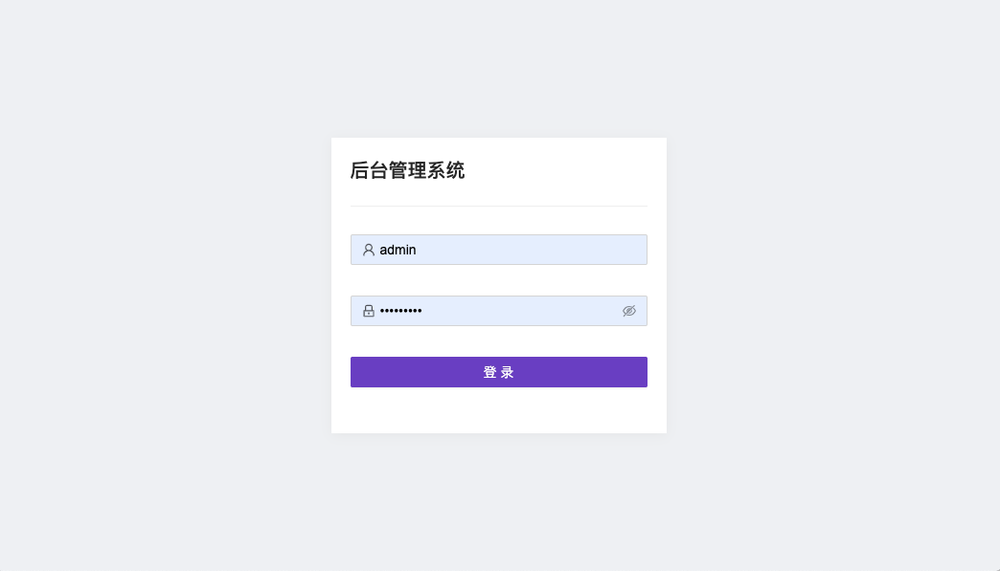
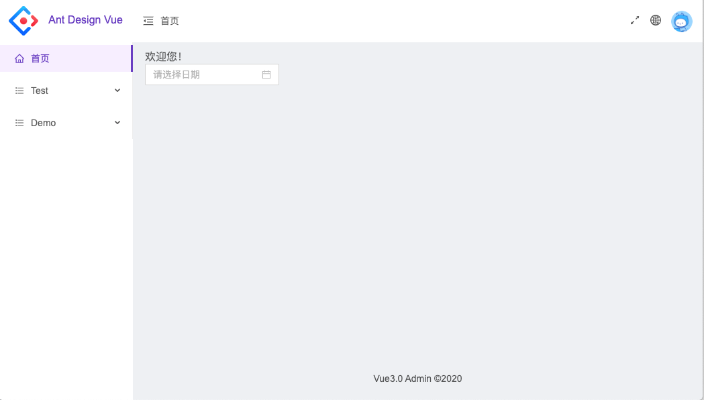

# vue开发脚手架二次开发后台管理系统模板
#### 简介： Vue 3.x、Ant Design Vue 2.x、国际化、router、vuex、ui仿antd-admin-pro、动态路由、动态菜单权限、页面状态缓存
## 作者： 月下独奏
### [更新日志](./note/updatelog.md)
##### 搭建不易，喜欢可以star
##### 如果喜欢react建议参考项目:[woleicom/react-admin-template](https://github.com/woleicom/react-admin-template)
-----------
### 感谢：
- [Vue 3](https://v3.vuejs.org/)
- [Ant Design Vue 2](https://2x.antdv.com/)
-----------
### 优化内容（所有依赖库基于2020年第二季度最新包版本）
- .eslintrc配置eslint规则
- .babelrc配置babel配置
- .postcssrc.js配置postcss配置
- .browserslistrc配置浏览器支持
- .env.*配置不同--mode模式下的环境变量
- 增加webpack end 插件，自动压缩打包文件并命名项目名称和打包日期时间
- 集成antd并可自定义theme
- UI参考antd admin pro
- 集成vue-router-next,并根据角色自动配置菜单和路由权限（权限在api中前端设置的测试数据）
- 导航面包屑根据用户菜单自动获取，不在放到页面手动配置。
- 集成vuex
- 增加utils/pageState缓存页面状态全局变量工具，没有存储storage，刷新无效
- 集成i18n国际化（使用vue-i18n-next集成国际化，导航头切换语言，首页查看效果）

### 相关命令
```
//启动前台服务
npm run serve
//打包staging环境
npm run build:prod
//打包正式环境
npm run build
```
-------------
##### 登录账号：admin/密码随便填 或 账号随便填/密码随便填  （两个账号权限不一样）
##### 只有views/Demo.vue 和 views/Detail.vue 语法用了Composition API
### 展示

